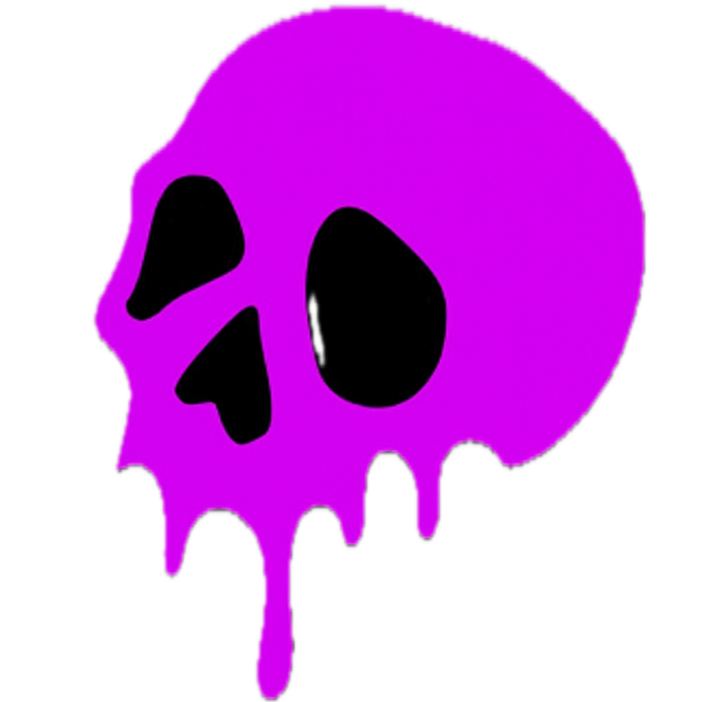

<div align="center">
  

  # Dosis.Fun

  **An underground survival RPG game on Starknet where you craft, trade, and dominate the black market.**
</div>

Dosis.Fun is a blockchain-based game built on the Starknet ecosystem that combines NFT mechanics, crafting systems, and a player-driven economy. Players mint character NFTs, gather ingredients, craft drugs with varying rarities, and trade them on a decentralized black market.

---

## 🎮 Project Overview

This monorepo contains all components of the Dosis.Fun ecosystem:

### Core Components

| Component | Description | Technology |
|-----------|-------------|------------|
| **Dosis** | Mobile game client | React Native + Expo |
| **DosisContracts** | Game logic contracts | Dojo Engine (Cairo ECS) |
| **dosisnft** | NFT & inventory contracts | Cairo + OpenZeppelin |
| **dosisfun-web** | Marketing website & minting | Next.js (separate repo) |

---

## 🎯 Game Mechanics

### Core Loop

1. **Mint a Character NFT** - Your on-chain identity with stats, inventory, and progression
2. **Buy Ingredients** - Purchase base materials from the black market
3. **Craft Drugs** - Combine ingredients using recipes with success/failure mechanics
4. **Trade on Black Market** - List your creations or buy from other players
5. **Level Up** - Gain experience, reputation, and unlock new crafting opportunities

### Character Stats

Each NFT character has persistent on-chain stats:
- **Level** (1-100) - Unlocks better recipes
- **Experience** - Gained from successful crafts
- **Reputation** (0-1000) - Affects crafting success rates
- **Cash** - In-game currency for trading
- **Crafting History** - Tracks successes and failures

### Drug System

- **Types**: Stimulant, Depressant, Hallucinogen, Opioid, Cannabis, Synthetic
- **Rarities**: Common, Uncommon, Rare, Epic, Legendary
- **Outcomes**: Critical Failure → Failure → Success → Critical Success
- **Purity & Quantity** - Determined by crafting roll and player stats

---

## 🏗️ Architecture

```
┌─────────────────────────────────────────────────────────────┐
│                     STARKNET BLOCKCHAIN                      │
│                                                              │
│  ┌─────────────────┐         ┌──────────────────────┐      │
│  │  dosisnft       │         │  DosisContracts      │      │
│  │  (Cairo NFT)    │◄────────┤  (Dojo ECS)          │      │
│  │                 │         │                      │      │
│  │ • Character NFTs│         │ • Drug Crafting      │      │
│  │ • Drug Tokens   │         │ • Black Market       │      │
│  │ • Ingredients   │         │ • Game Logic         │      │
│  │ • Stats Storage │         │ • Randomness         │      │
│  └─────────────────┘         └──────────────────────┘      │
│         ▲                              ▲                     │
└─────────┼──────────────────────────────┼─────────────────────┘
          │                              │
          │         Contract Calls       │
          │                              │
     ┌────┴────────────────────┬─────────┴─────┐
     │                         │               │
┌────▼─────────┐      ┌────────▼──────┐   ┌───▼──────────┐
│ Dosis Mobile │      │ dosisfun-web  │   │   Future     │
│ (React Native)│      │ (Next.js)     │   │   Clients    │
│              │      │               │   │              │
│ • Gameplay   │      │ • Marketing   │   │ • Desktop    │
│ • Wallet     │      │ • NFT Minting │   │ • Web Game   │
│ • Crafting UI│      │ • Profiles    │   │              │
└──────────────┘      └───────────────┘   └──────────────┘
```

---

## 🚀 Getting Started

### Prerequisites

Install the following tools based on which component you want to run:

#### For All Components
- [Node.js](https://nodejs.org/) (v24 or higher)
- [Git](https://git-scm.com/)

#### For Smart Contracts (DosisContracts)
- [Rust](https://rustup.rs/) (latest stable)
- [Dojo Engine](https://book.dojoengine.org/getting-started/quick-start.html) v1.7.0
  ```bash
  curl -L https://install.dojoengine.org | bash
  dojoup install
  ```

#### For NFT Contracts (dosisnft)
- [Scarb](https://docs.swmansion.com/scarb/) (Cairo package manager)
- [Starknet Foundry](https://foundry-rs.github.io/starknet-foundry/) (snforge/sncast)
  ```bash
  curl -L https://raw.githubusercontent.com/foundry-rs/starknet-foundry/master/scripts/install.sh | sh
  ```

#### For Mobile App (Dosis)
- [Expo CLI](https://docs.expo.dev/get-started/installation/)
- iOS Simulator (Mac only) or Android Studio

---

## 📱 Running the Mobile App

The main game client built with React Native and Expo.

### Installation

```bash
cd Dosis
npm install
```

### Development

```bash
# Start development server
npm start

# Run on iOS simulator (Mac only)
npm run ios

# Run on Android emulator
npm run android

# Run on web browser
npm run web
```

### Configuration

- **Network**: Starknet Sepolia testnet (configured in code)
- **Orientation**: Landscape only
- **Wallet**: Integrated with @cavos/aegis for Starknet

### Key Features

- **File-based routing** via Expo Router
- **Screens**:
  - `app/index.tsx` - Main game screen
  - `app/wallet.tsx` - Wallet management
  - `app/drug-crafting.tsx` - Crafting interface
  - `app/black-market.tsx` - Marketplace
  - `app/buy-ingredient.tsx` - Ingredient purchasing
  - `app/list-drug.tsx` - Drug listing

---

## 🎲 Running Game Contracts (DosisContracts)

Dojo Engine contracts that power the game mechanics.

### Installation

```bash
cd DosisContracts
sozo build
```

### Local Development

```bash
# Start local Katana node (Starknet devnet)
katana --disable-fee

# In another terminal, migrate contracts
sozo migrate --profile dev

# Run tests
sozo test
```

### Deploy to Sepolia Testnet

```bash
sozo migrate --profile sepolia
```

### Contract Systems

- **drug_crafting_system** (0x03d469f506db8c193f26795b2688a453f683a39caefd2d868146391493126d7e)
  - `craft_drug()` - Combine ingredients to create drugs

- **black_market_system** (0x04c61c998b9b524cc646d1cf508476e287d4f2f60395932f3368cf6278d3c75a)
  - `list_drug()` - List drug for sale
  - `cancel_listing()` - Remove listing
  - `buy_drug()` - Purchase listed drug
  - `buy_ingredient()` - Purchase base ingredients
  - `get_active_listings()` - View marketplace
  - `get_seller_listings()` - View your listings

### Configuration Files

- `dojo_dev.toml` - Local Katana configuration
- `dojo_sepolia.toml` - Sepolia testnet configuration
- `dojo_mainnet.toml` - Mainnet configuration (future)

---

## 🎨 Running NFT Contracts (dosisnft)

Cairo contracts for character NFTs and item management.

### Installation

```bash
cd dosisnft
scarb build
```

### Testing

```bash
snforge test
```

### Deploy

```bash
# Declare contract class
sncast declare --contract-name MyToken

# Deploy instance
sncast deploy --class-hash <CLASS_HASH>
```

### Contract Features

**Deployed Contract**: 0x02232fb520090d5c76d8d84de9829eea7c34c5e6234a5a2a8b178d18e2aedbd7

#### Role-Based Access Control

- `DEFAULT_ADMIN_ROLE` - Full administrative control
- `DOSIS_CONTRACT_ROLE` - Game contract interactions
- `MINT_ROLE` - Minting permissions

#### Core Functions

**Character Management:**
- `public_mint()` - Public NFT minting (paid with STRK)
- `mint()` - Admin/role-based minting
- `get_character_stats()` - Retrieve character data
- `update_character_stats()` - Update stats (called by game contracts)

**Drug Management:**
- `mint_drug()` - Create drug NFT
- `get_drug()` - Retrieve drug data
- `get_character_drugs()` - List character's drugs
- `lock_drug()` / `unlock_drug()` - State management
- `transfer_drug_ownership()` - Trade drugs
- `consume_drug()` - Remove drug from inventory

**Ingredient Management:**
- `mint_ingredient()` - Purchase ingredients
- `get_character_ingredient()` - Check ingredient quantity
- `get_character_ingredients()` - List all ingredients
- `consume_ingredient()` - Use in crafting

**Admin Functions:**
- `pause()` / `unpause()` - Emergency stops
- `set_mint_price()` - Configure mint cost
- `set_treasury()` - Set payment recipient
- `upgrade()` - Contract upgrades

---

## 🌐 Running Marketing Website (dosisfun-web)

**Note**: This is in a separate repository at `/Users/adran/Documents/repos/dosisfun/dosisfun-web/`

### Installation

```bash
cd ../dosisfun-web
npm install
```

### Development

```bash
npm run dev
```

Open [http://localhost:3000](http://localhost:3000)

### Production Build

```bash
npm run build
npm start
```

### Features

- NFT minting interface
- Black market showcase
- User profiles
- Multi-wallet support (MetaMask + Starknet wallets)

---

## 🎮 Game Flow Example

Here's how a typical game session works:

```bash
# 1. Mint a character NFT
# Contract: dosisnft
# Function: public_mint()
# Cost: Configured STRK amount

# 2. Buy ingredients
# Contract: black_market_system
# Function: buy_ingredient(nft_token_id: 1, ingredient_id: 100, quantity: 50)

# 3. Craft a drug
# Contract: drug_crafting_system
# Function: craft_drug(
#   nft_token_id: 1,
#   name: "Fasito",
#   base_ingredients: [(100, 50)],
#   drug_ingredient_ids: []
# )

# 4. List drug for sale
# Contract: black_market_system
# Function: list_drug(nft_token_id: 1, drug_id: 1)
# Returns: listing_id

# 5. Another player buys your drug
# Contract: black_market_system
# Function: buy_drug(buyer_nft_token_id: 2, listing_id: 1)
```

---

## 📊 Viewing Game Data

### Character Information

```cairo
// Get character stats
NFT.get_character_stats(token_id: 1)
// Returns: CharacterStats { level, experience, reputation, cash, ... }

// Get character's ingredients
NFT.get_character_ingredients(token_id: 1)
// Returns: Array of (ingredient_id, quantity)

// Get character's drugs
NFT.get_character_drugs(token_id: 1)
// Returns: Array of drug_ids
```

### Drug Information

```cairo
// Get drug details
NFT.get_drug(drug_id: 1)
// Returns: Drug { name, type, rarity, purity, quantity, ... }
```

### Marketplace Information

```cairo
// Get all active listings
black_market.get_active_listings()
// Returns: Array of MarketListing

// Get specific listing details
black_market.get_listing(listing_id: 1)
// Returns: MarketListing { seller, drug_id, price, ... }

// Get your listings
black_market.get_seller_listings(nft_token_id: 1)
// Returns: Array of your MarketListing
```

---

## 🔧 Development Status

### ✅ Completed Features

- ✅ Character NFT minting
- ✅ Ingredient purchasing system
- ✅ Drug crafting mechanics
- ✅ Black market (list, buy, cancel)
- ✅ Mobile app with full UI
- ✅ Stats tracking and leveling
- ✅ On-chain inventory management

### 🚧 In Progress / Planned

- 🚧 Bug fix: Enum handling for drug rarity
- 🚧 Improved stat calculation for drug outcomes
- 🚧 VRF (Verifiable Random Function) for true randomness
- 🚧 Leaderboard system
- 🚧 Boss battles / PvE mechanics

---

## 📁 Project Structure

```
dosisfun/
├── Dosis/                    # React Native mobile app
│   ├── app/                  # Expo Router pages
│   ├── components/           # React components
│   ├── services/             # Blockchain integration
│   └── package.json
│
├── DosisContracts/          # Dojo game contracts
│   ├── src/
│   │   ├── models/          # ECS models (PlayerNFT, Drug, Recipe)
│   │   └── systems/         # Game systems (crafting, market)
│   ├── dojo_dev.toml
│   ├── dojo_sepolia.toml
│   └── Scarb.toml
│
├── dosisnft/                # NFT contracts
│   ├── src/
│   │   ├── token.cairo      # Main NFT contract
│   │   ├── models.cairo     # Data structures
│   │   └── formater.cairo   # Metadata generation
│   └── Scarb.toml
│
├── dosis_nft/               # (Legacy - archived)
├── dosisfun-contracts/      # (Legacy - unused)
└── pending.md               # Development notes

../dosisfun-web/             # Next.js marketing site (separate repo)
```

---

## 🌍 Network Information

**Current Network**: Starknet Sepolia Testnet

### Deployed Contracts

| Contract | Address | Type |
|----------|---------|------|
| **dosisnft** | `0x02232fb520090d5c76d8d84de9829eea7c34c5e6234a5a2a8b178d18e2aedbd7` | NFT & Inventory |
| **drug_crafting_system** | `0x03d469f506db8c193f26795b2688a453f683a39caefd2d868146391493126d7e` | Dojo System |
| **black_market_system** | `0x04c61c998b9b524cc646d1cf508476e287d4f2f60395932f3368cf6278d3c75a` | Dojo System |

**Namespace**: `dosis_game4`

---

## 🛠️ Technology Stack

### Blockchain Layer
- **Blockchain**: Starknet
- **Smart Contract Languages**: Cairo 2.12.2
- **Game Framework**: Dojo Engine 1.7.0 (ECS pattern)
- **NFT Standard**: ERC721 (OpenZeppelin 2.0.0)
- **Testing**: Starknet Foundry (snforge)

### Frontend Layer
- **Mobile**: React Native 0.81.4 + Expo 54
- **Web**: Next.js 15.5.3 + React 19
- **Styling**: Tailwind CSS v4
- **Language**: TypeScript 5
- **State**: React Context + TanStack Query

### Wallet Integration
- **Mobile**: @cavos/aegis (Starknet)
- **Web**: StarknetKit + Wagmi (multi-chain)

### Build Tools
- **Cairo**: Scarb package manager
- **Dojo**: sozo CLI
- **Mobile**: Expo CLI
- **Web**: Next.js with Turbopack

---

## 🤝 Contributing

### Development Workflow

1. **Pick a component** to work on (contracts, mobile, web)
2. **Create a feature branch** from `main`
3. **Make changes** following the existing code style
4. **Test thoroughly**:
   - Contracts: `sozo test` or `snforge test`
   - Mobile: Test on iOS/Android simulators
   - Web: Test in browser
5. **Submit PR** to `main` branch

### Code Style

- Use TypeScript for all JavaScript code
- Follow Cairo best practices for contracts
- Write tests for new features
- Document public functions
- Use meaningful commit messages

---

## 📝 License

[Add your license here]

---

## 🔗 Links

- **Documentation**: [Coming soon]
- **Discord**: [Add community link]
- **Twitter**: [Add social link]
- **Starknet Explorer**: https://sepolia.starkscan.co/

---

## 🆘 Troubleshooting

### Mobile App Issues

**Problem**: "Cannot connect to wallet"
- **Solution**: Ensure you're on Sepolia testnet in your Starknet wallet

**Problem**: "Expo start fails"
- **Solution**: Clear cache with `npm start -- --clear`

### Contract Issues

**Problem**: "sozo not found"
- **Solution**: Install Dojo with `curl -L https://install.dojoengine.org | bash && dojoup install`

**Problem**: "Contract not found"
- **Solution**: Ensure contracts are deployed to the correct network (check manifest files)

### Build Issues

**Problem**: "Scarb build fails"
- **Solution**: Verify Cairo version matches Scarb.toml (2.12.2)

**Problem**: "Module not found in Node"
- **Solution**: Delete `node_modules` and run `npm install` again

---

## 📬 Support

For bugs and feature requests, open an issue on GitHub.

For general questions, join our Discord community.

---

**Built with 🔥 on Starknet**
